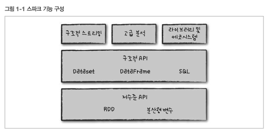
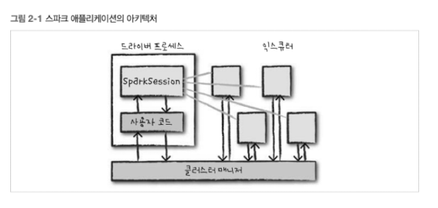
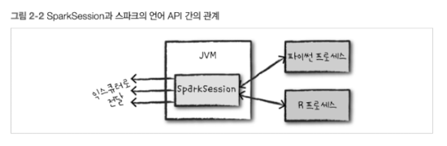
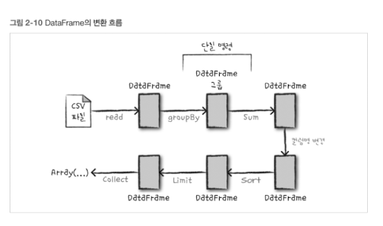

[Spark-The-Definitive-Guide](https://github.com/FVBros/Spark-The-Definitive-Guide/tree/master)

# 1. 아파치 스파크란?

- 통합 컴퓨팅 엔진
- 클러스터 환경에서 데이터를 병렬로 처리하는 라이브러리 집합
- 병렬 처리 오픈소스 엔진
- 파이썬, 자바, 스칼라, R 지원
- SQL, 스트리밍, 머신러닝 라이브러리 제공
- 단일 노트북 환경 ~ 수천 대의 서버로 구성된 클러스터 환경에서 실행 가능



## 1.1 아파치 스파크의 철학

아파치 스파크: 빅데이터를 위한 통합 컴퓨팅 엔진과 라이브러리 집합

통합(unified)

- 다양한 분석 작업을 연산 엔진과 일관성 있는 API로 수행하도록 설계

컴퓨팅 엔진

- 스파크는 영구 저장소 역할을 수행 X
- 대신 클라우드 기반, 분산 파일 시스템, 키/값 저장소, 메시지 전달 서비스 등의 서비스를 지원
- 데이터 저장 위치에 상관없이 처리에 집중

vs 하둡

- 범용 서버 클러스터 환경에서 저비용 저장 장치를 사용하도록 설계
- 하둡 파일 시스템 + 컴퓨팅 시스템(맵 리듀스)
- 단점
  - 둘 중 하나의 시스템만 단독으로 사용하기 어려움
  - 다른 저장소에 접근 하기 어려움

스파크가 유리한 환경

- 공개형 클라우스: 연산 노드와 저장소를 별도로 구매 가능
- 스트리밍 애플리케이션

라이브러리

- 스파크 SQL
- MLib: 머신러닝
- 스파크 스트리밍
- GraphX: 그래프 분석 엔진
- 저장소 시스템을 위한 커넥터

## 1.2 스파크의 등장 배경

컴퓨터 애플리케이션과 하드웨어 바탕을 이루는 경제적 변화

- 기술적 변화: 하드웨어 성능 향상 정체 -> 성능 향상을 위한 병렬 처리 (스파크와 같은 프로그래밍 모델)
- 경제적 변화: 데이터 저장 & 수집 비용 감소

## 1.3 스파크의 역사

하둡 맵리듀스

- 수천 개의 노드로 구성된 클러스터에서 병렬로 데이터를 처리
- 클러스터 환경용 병렬 프로그래밍 엔진

맵리듀스 엔진의 한계

- (난이도) 단계별로 맵리듀서 잡을 개발 필요
- (효율성) 각 클러스터에서 매번 데이터를 처음 부터 읽어야 함

해결방안

- (난이도) 개발을 쉽게 할 수 있는 함수형 프로그래밍 기반 API 설계
- (효율성) 연산 단계 사이에서 메모리에 저장된 데이터를 공유할 수 있는 새로운 엔진 기반 API를 구현

스파크 버전

- 배치 애플리케이션 지원
- 대화형 데이터 분석, 비정형 쿼리 기능 제공
- 샤크 공개: 대화형으로 SQL를 실행할 수 있는 엔진
- MLlib
- 스파크 스트리밍
- GraphX

스파크 API

- 초기 버전: **함수형 연산 관점 API** (컬렉션, 리듀스)
- 1.0 버전 이후: **구조화된 데이터를 기반한 API** (스파크 SQL)
- 차세대: **구조체 기반 API** (DataFrame, 머신러닝 파이프라인, 자동 최적화 수행)

## 1.4 스파크의 현재와 미래

## 1.5 스파크 실행 하기

## 1.6 정리

- 스파크의 개요
- 탄생 배경
- 환경 구성 방법

# 2. 스파크 간단하게 살펴보기

## 2.1 스파크의 기본 아키텍처

클러스터가 필요한 이유? 한 대의 컴퓨터에서 수행 할 수 없는 대규모 데이터를 처리하기 위해

클러스터란? 여러 컴퓨터의 자원을 모아 하나의 컴퓨터 처럼 사용할 수 있도록 해줌

스파크?

- 클러스터에서 작업을 관리하고 조율
- 클러스터 매니저: 스파크 스탠드어론(standalone) 클러스터 매니저, 하둡 YARN, 메소스(Mesos)
- 사용자 -> 클러스터 매니저: 스파크 애플리케이션 제출
- 클러스터 매니저 -> 애플리케이션: 자원을 할당
- 애플리케이션: 할당된 자원으로 작업을 처리

### 2.1.1 스파크 애플리케이션

구성

- 드라이브 프로세스 (필수)
  - 클러스터 노드 중 하나에서 `main()` 함수를 실행
  - 역할
    - 애플리케이션의 수명 주기 동안 관련 정보를 모두 유지
    - 스파크 애플리케이션 정보의 유지 관리
    - 사용자 프로그램이나 입력에 대한 응답
    - 전반적인 익스큐터 프로세스의 작업과 관련된 분석, 배포
    - 스케줄링
- 익스큐터 프로세스
  - 역할
    - 드라이버가 할당한 코드를 실행
    - 진행 상황을 다시 드라이버 노드에 보고



클러스터 매니저가 물리적 머신을 관리하고 스파크 애플리케이션에 자원을 할당하는 방법

- 클러스터 매니저: 스파크 스탠드어론(standalone) 클러스터 매니저, 하둡 YARN, 메소스(Mesos) 중 선택
- 하나의 클러스터에서 여러 개의 스파크 애플리케이션을 실행 가능
- 그림: 1 개의 드라이버 + 4 개의 익스큐터
- 사용자는 각 노드에 할당할 익스큐터 수를 지정 가능

스파크

- 클러스터 모드: 같은 머신 혹은 다른 머신에서 드라이버와 익스큐터를 실행 가능
- **로컬 모드: 드라이버와 익스큐터를 단일 머신에서 스레드 형태로 실행**

스파크 애플리케이션 아키텍처

- 클러스터 매니저: 사용 가능한 자원을 파악
- 드라이버 프로세스: 주어진 작업을 완료하기 위해 드라이버 명령을 익스큐에서 실행
- 익스큐터: 스파크 코드를 실행, 스파크의 언어 API를 통해 다양한 언어로 실행

## 2.2 스파크의 다양한 언어 API

스파크는 다양한 언어를 제공하고 구조적 API 만으로 작성된 코드는 유사한 성능을 발휘 한다.

- 스칼라: (기본) 스파크의 기본 언어
- 자바
- 파이썬
- SQL
- R



SparkSession

- 스파크 코드를 실행하기 위한 진입점으로 사용하는 객체
- 스파크는 사용자를 대신해 파이썬, R 코드를 익스큐터의 JVM에서 실행할 수 있는 코드로 변환

## 2.3 스파크 API

- 저수준 비구조적 API
- 고수준 구조적 API

## 2.4 스파크 시작하기

대화형 모드 시작 -> SparkSession이 자동으로 생성

스탠드얼론 애플리케이션 -> 사용자 애플리케이션에서 SparkSession 객체를 직접 생성

## 2.5 SparkSession

SparkSession 인스턴스

- 사용자가 정의한 처리 명령을 클러스터에서 실행
- 하나의 세션은 하나의 스파크 애플리케이션에 대응

```py
# findspark: Jupyter Notebook이나 일반 Python 환경에서 PySpark를 쉽게 사용할 수 있도록 설정하는 역할을 합니다.
import findspark
findspark.init()

from pyspark.sql import SparkSession

# Create a Spark session
spark = SparkSession.builder.appName("MyApp").getOrCreate()

# spark isntance
spark
"""
SparkSession - in-memory

SparkContext

Spark UI

Version
v3.5.4
Master
local[*]
AppName
MyApp
"""
```

일정 범위의 숫자를 만드는 간단한 작업 수행

```py
myRange = spark.range(1000).toDF("number")
# 한 개의 컬럼과 1000개의 로우로 구성된 데이터프레임
# 0 - 999 할당
# 숫자는 분산 컬렉션을 나타낸다.
# 클러스터 모드에서는 숫자 범위의 각 부분이 서로 다른 익스큐터에 할당된다.

myRange
# DataFrame[number: bigint]
```

## 2.6 DataFrame

- 대표적인 구조적 API
- 테이블의 데이터를 로우와 컬럼으로 단순하게 표현
- 스키마(schema): 컬럼과 컴럼의 타입을 정의한 목록
- 스파크의 데이터프레임은 단일 컴퓨터에 저장하기 힘든 데이터를 수천 대의 컴퓨터에 분산하여 처리
- 파이썬, R 데이터프레임 (단일 컴퓨터) -> 스파크 데이터프레임 (분산 컴퓨터)

분산 데이터 모음

- Dataset
- DataFrame
- SQL 테이블
- RDD

### 2.6.1 파티션

- 모든 익스큐터가 병렬로 작업을 수행하도록 데이터를 파티션(청크 단위)으로 데이터를 분할
- 클러스터 물리적 머신에 존재하는 로우의 집합
- 병렬성 = min(파티션의 수, 익스큐터의 수)
  - 하나의 파티션 + 수천 개의 익스큐터 -> 병렬성: 1
  - 수백개의 파티션 + 하나의 익스큐터 -> 병렬성: 1
- 데이터프레임을 사용하면 물리적 파티션에 데이터 변환용 함수를 지정하면 스파크가 실제 처리 방법을 결정. (고수준 API)
- RDD 인터페이스: 저수준 API 제공

## 2.7 트랜스포메이션

불변성(immutable): 한번 생성하면 변경 할 수 없다.

데이터프레임을 변경하려면 원하는 변경 방법을 스파크에 알려줘야 한다.

트랜스포메이션: 데이터프레임을 변경할 떄 사용하는 명령어

```py
# 데이터프레임에서 짝수를 찾는 트랜스포메이션 예제
divisBy2 = myRange.where("number % 2 = 0")
```

액션을 호출하지 않으면 스파크는 트렌스포메이션을 수행하지 않는다.

유형

- 좁은 의존성 (1:1)
  - 각 입력 파티션이 하나의 출력 파티션에만 영향을 미친다. (ex. where)
  - 파이프라이닝을 자동으로 수행
  - 모든 작업이 메모리에서 일어남
- 넓은 의존성 (1:N)
  - 하나의 입력 파티션이 여러 출력 파티션에 영향을 미친다. (ex. shuffle)
  - 작업의 결과를 디스크에 저장

### 2.7.1 지연 연산(lazy evaluation)

- 스파크가 연산 그래프를 처리하기 직전까지 기다리는 동작 방식
- 연산 명령 -> 트랜스포메이션 실행 계획 생성 -> 코드 실행 까지 대기 -> 간결한 물지적 실행 계획으로 컴파일 -> 실행
- 이 과정을 통해 전체 데이터 흐름을 최적화 할 수 있다.

## 2.8 액션

- 실제 연산을 수행하려면 액션 명령을 내려야 한다.
- 액션은 결과를 계산하도록 지시하는 명령
- `count()`: 데이터프레임의 전체 레코드 수를 반환

```py
divisBy2.count()
# 500
```

액션의 종류

- 콘솔에서 데이터를 보는 액션
- 각 언어로 된 네이티브 객체에 데이터를 모으는 액션
- 출력 데이터소스에서 저장하는 액션

## 2.9 스파크 UI

- 스파크 잡의 진행 상황을 모니터링할 때 사용
- 드라이버 노드의 4040 포트로 접속 (localhost:4040)
- [spark.sparkContext.uiWebUrl](http://bagjongseon-ui-Macmini.local:4040)

```py
# Find the Spark UI URL
spark.sparkContext.uiWebUrl
# 'http://bagjongseon-ui-Macmini.local:4040'
```

## 2.10 종합 예제

미국 교통통계국의 항공운항 데이터 중 일부를 스파크로 분석

[notebook](./notebooks/2-10.ipynb)

```py
# Import Libraries
from pyspark.sql import SparkSession

# Create Spark session
spark = SparkSession.builder.appName("MyApp").getOrCreate()

# Read Data with Options
# inferSchema: 스키마 추론 기능 사용
# header: 파일의 첫 로우를 헤더로 지정
flightData2015 = spark\
  .read\
  .option("inferSchema", "true")\
  .option("header", "true")\
  .csv("../data/flight-data/csv/2015-summary.csv")
```

`take()`

- head() 명령과 같은 결과를 얻을 수 있다.

`sort()`

- 데이터프레임을 변경하지 않는다.
- 이전의 데이터프레임을 사용해 새로운 데이터프레임을 생성해 반환한다.
- 트랜스포메이션 이기 때문에 호출 시 데이터에는 아무런 변화도 일어나지 않는다. (실행 계획만 세움)

CSV 파일 -> DF -> DF -> Arrary(...)

- `read()`: 좁은 트랜스포메이션
- `sort()`: 넓은 트랜스포메이션
- `take(3)`

`explain()`

- 데이터페이스의 계보(lineage)나 스파크 쿼리 실행 계획을 확인 할 수 있다.

데이터 계보(Data Lineage)

- 데이터가 어떻게 생성, 변형, 전파되었는지를 추적하는 개념
- 데이터의 출처와 변형 과정을 기록하여 데이터의 흐름을 파알할 수 있도록 한다.

`flightData2015.sort("count").explain()`

```
== Physical Plan ==
AdaptiveSparkPlan isFinalPlan=false
+- Sort [count#82 ASC NULLS FIRST], true, 0
   +- Exchange rangepartitioning(count#82 ASC NULLS FIRST, 200), ENSURE_REQUIREMENTS, [plan_id=113]
      +- FileScan csv [DEST_COUNTRY_NAME#80,ORIGIN_COUNTRY_NAME#81,count#82] Batched: false, DataFilters: [], Format: CSV, Location: InMemoryFileIndex(1 paths)[file:/Users/park/Desktop/Spark - The Definitive Guide/data/flight-data..., PartitionFilters: [], PushedFilters: [], ReadSchema: struct<DEST_COUNTRY_NAME:string,ORIGIN_COUNTRY_NAME:string,count:int>
```

```py
# 액션 호출
# 셔플 파티션 생성 (기본값: 200)
# 셔풀의 출력 파티션을 5로 설정

spark.conf.set("spark.sql.shuffle.partitions", "5")

flightData2015.sort("count").take(5)
```

```
[Row(DEST_COUNTRY_NAME='Malta', ORIGIN_COUNTRY_NAME='United States', count=1),
 Row(DEST_COUNTRY_NAME='Saint Vincent and the Grenadines', ORIGIN_COUNTRY_NAME='United States', count=1),
 Row(DEST_COUNTRY_NAME='United States', ORIGIN_COUNTRY_NAME='Croatia', count=1),
 Row(DEST_COUNTRY_NAME='United States', ORIGIN_COUNTRY_NAME='Gibraltar', count=1),
 Row(DEST_COUNTRY_NAME='United States', ORIGIN_COUNTRY_NAME='Singapore', count=1)]
```

트랜스포메이션의 논리적 실행 계획

- 데이터프레임의 계보를 정의
- 계보를 통해 입력 데이터에 수행한 연산을 전체 파티션에서 어떻게 재연산하는지 확인
- 함수형 프로그래밍의 핵심 (같은 입력에 대해 항상 같은 출력을 생성)

사용자는 물리적 데이터를 직접 다루지 않는다. 대신 속성(ex. 셔플 파티션 파라미터)으로 물리적 실행 특성을 제어한다.

스파크 UI에 접속해 잡의 실행 상태와 스파크의 물리적, 논리적 실행 특정을 확인 할 수 있다.

### 2.10.1 DataFrame과 SQL

스파크는 언어와 상관없이 같은 방식으로 트랜스포메이션을 실행 할 수 있다.

SQL, DataFrame으로 비즈니스 로직을 표현하면 스파크에서 실제 코드를 실행하기 전에 그 로직을 기본 실행 계획으로 컴파일한다.

스파크 SQL

- DataFrame을 테이블이나 뷰(임시 테이블)로 등록한 후 SQL 쿼리를 실행 할 수 있다.

```py
# 데이터프레임을 테이블로 변환
flightData2015.createOrReplaceTempView("flight_data_2015")
```

테이블 / 뷰(임시 테이블)

- SQL로 데이터를 조회 가능

`spark.sql`

- SQL 쿼리 실행
- 쿼리를 실행하면 새로운 데이터프레임을 반환

```py
sqlWay = spark.sql("""
SELECT DEST_COUNTRY_NAME, count(1)
FROM flight_data_2015
GROUP BY DEST_COUNTRY_NAME
""")

dataFrameWay = flightData2015\
.groupBy("DEST_COUNTRY_NAME")\
.count()

sqlWay.explain()
dataFrameWay.explain()
```

```
== Physical Plan ==
AdaptiveSparkPlan isFinalPlan=false
+- HashAggregate(keys=[DEST_COUNTRY_NAME#80], functions=[count(1)])
   +- Exchange hashpartitioning(DEST_COUNTRY_NAME#80, 5), ENSURE_REQUIREMENTS, [plan_id=141]
      +- HashAggregate(keys=[DEST_COUNTRY_NAME#80], functions=[partial_count(1)])
         +- FileScan csv [DEST_COUNTRY_NAME#80] Batched: false, DataFilters: [], Format: CSV, Location: InMemoryFileIndex(1 paths)[file:/Users/park/Desktop/Spark - The Definitive Guide/data/flight-data..., PartitionFilters: [], PushedFilters: [], ReadSchema: struct<DEST_COUNTRY_NAME:string>


== Physical Plan ==
AdaptiveSparkPlan isFinalPlan=false
+- HashAggregate(keys=[DEST_COUNTRY_NAME#80], functions=[count(1)])
   +- Exchange hashpartitioning(DEST_COUNTRY_NAME#80, 5), ENSURE_REQUIREMENTS, [plan_id=154]
      +- HashAggregate(keys=[DEST_COUNTRY_NAME#80], functions=[partial_count(1)])
         +- FileScan csv [DEST_COUNTRY_NAME#80] Batched: false, DataFilters: [], Format: CSV, Location: InMemoryFileIndex(1 paths)[file:/Users/park/Desktop/Spark - The Definitive Guide/data/flight-data..., PartitionFilters: [], PushedFilters: [], ReadSchema: struct<DEST_COUNTRY_NAME:string>
```

`max()`

- 데이터프레임의 특정 컬럼 값을 스캔하면서 이전 최댓값보다 더 큰값을 찾는다
- 필터링을 수행해 단일 로우를 결과를 반환하는 트랜스포메이션

```py
# 특정 위치를 왕래하는 최대 비행 횟수를 구한다

# using spark sql
spark.sql("SELECT max(count) from flight_data_2015").take(1)

# using data frame
from pyspark.sql.functions import max
flightData2015.select(max("count")).take(1)
```

결과값

```
[Row(max(count)=370002)]
```

상위 5개의 도착 국가를 찾아내는 코드 (다중 트랜스포메이션 쿼리)

spark.sql

```py
# 상위 5개의 도착 국가를 찾아내는 코드

maxSql = spark.sql("""
SELECT DEST_COUNTRY_NAME, sum(count) as destination_total
FROM flight_data_2015
GROUP BY DEST_COUNTRY_NAME
ORDER BY sum(count) DESC
LIMIT 5
""")

maxSql.show()
```

결과값

```
+-----------------+-----------------+
|DEST_COUNTRY_NAME|destination_total|
+-----------------+-----------------+
|    United States|           411352|
|           Canada|             8399|
|           Mexico|             7140|
|   United Kingdom|             2025|
|            Japan|             1548|
+-----------------+-----------------+
```

dataframe

```py
from pyspark.sql.functions import desc

flightData2015\
.groupBy("DEST_COUNTRY_NAME")\
.sum("count")\
.withColumnRenamed("sum(count)", "destination_total")\
.sort(desc("destination_total"))\
.limit(5)\
.show()
```

결과값

```
from pyspark.sql.functions import desc

flightData2015\
.groupBy("DEST_COUNTRY_NAME")\
.sum("count")\
.withColumnRenamed("sum(count)", "destination_total")\
.sort(desc("destination_total"))\
.limit(5)\
.show()
```

지향성 비순환 그래프(directed acyclic graph, DAG)

- 실행 계획은 트렌스포메이션의 DAG 이다.
- 액션이 호출 되면 결과를 만들어 낸다.
- 각 단계는 불변성을 가진 신규 데이터프레임을 생성한다.



1. `read()`: 데이터를 읽는다. (트랜스포메이션)
2. `groupBy()`: 그룹화된 데이터셋을 반환 (RelationalGroupedDataset)
3. `sum()`: 새로운 스키마를 가진 데이터프레임을 생성한다. (트랜스포메이션)
4. `withColumnRenamed()`: 컬럼명을 변경한다. (트랜스포메이션)
5. `sort()`: 역순 정렬하기 위해 desc 함수를 사용한다. (트랜스포메이션)
6. `limit()`: 반환 결과의 수를 제한한다. (트랜스포메이션)
7. `collect()`: 데이터프레임의 결과를 모으는 프로세스를 시작한다. (액션)

```py
flightData2015\
.groupBy("DEST_COUNTRY_NAME")\
.sum("count")\
.withColumnRenamed("sum(count)", "destination_total")\
.sort(desc("destination_total"))\
.limit(5)\
.explain()
```

```
== Physical Plan ==
AdaptiveSparkPlan isFinalPlan=false
+- TakeOrderedAndProject(limit=5, orderBy=[destination_total#161L DESC NULLS LAST], output=[DEST_COUNTRY_NAME#57,destination_total#161L])
   +- HashAggregate(keys=[DEST_COUNTRY_NAME#57], functions=[sum(count#59)])
      +- Exchange hashpartitioning(DEST_COUNTRY_NAME#57, 5), ENSURE_REQUIREMENTS, [plan_id=299]
         +- HashAggregate(keys=[DEST_COUNTRY_NAME#57], functions=[partial_sum(count#59)])
            +- FileScan csv [DEST_COUNTRY_NAME#57,count#59] Batched: false, DataFilters: [], Format: CSV, Location: InMemoryFileIndex(1 paths)[file:/Users/park/Desktop/Spark - The Definitive Guide/data/flight-data..., PartitionFilters: [], PushedFilters: [], ReadSchema: struct<DEST_COUNTRY_NAME:string,count:int>

```

## 2.11 정리

- 아파치 스파크의 기초
- 트랜스포메이션
- 액션
- 데이터프레임 실행 계획 최적화
- 트랜스포메이션 지향성 비순환 그래프 지연 실행
- 데이터 파티션 구성 방법
- 복잡한 트랜스포메이션 작업 실행 단계

# 3. 스파크 기능 둘러보기
