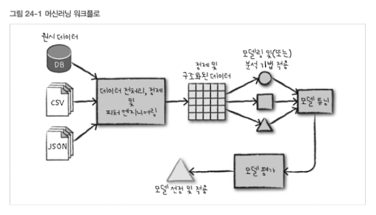
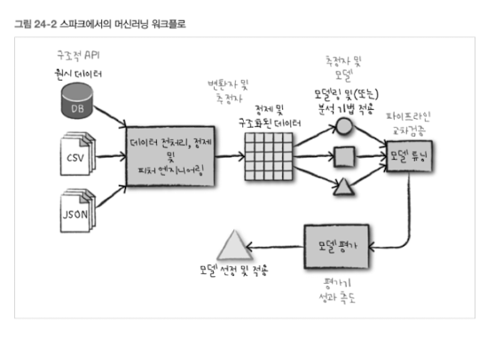
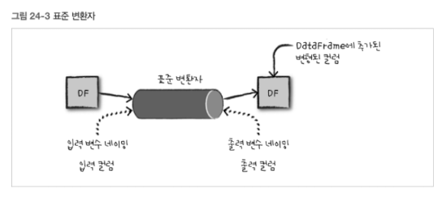
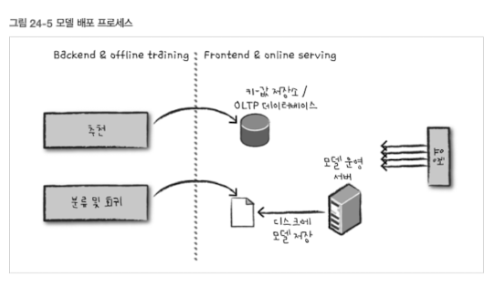

# 24. 고급 분석과 머신러닝 개요

## 24.1 고급 분석에 대한 짧은 입문서

고급 분석

- 데이터 기반의 인사이트를 도출하여 핵심 문제를 해결하거나 예측 또는 추천을 하기 위한 기술

개별 분석 방법로 자료

- 📘 An Introduction to Statistical Learning With Applications in R (ISL)

  - Springer 출판 (2013)
  - 저자: Gareth James, Daniela Witten, Trevor Hastie, Robert Tibshirani
  - 링크: https://www.statlearning.com/ (무료 PDF 제공)

- 📗 The Elements of Statistical Learning (ESL)

  - Springer Verlag 출판 (2009, 2nd edition)
  - 저자: Trevor Hastie, Robert Tibshirani, Jerome Friedman
  - 링크: https://web.stanford.edu/~hastie/ElemStatLearn/ (무료 PDF 제공)

- 📙 Deep Learning (DLB)

  - MIT Press 출판 (2016)
  - 저자: Ian Goodfellow, Yoshua Bengio, Aaron Courville
  - 링크: https://www.deeplearningbook.org/ (무료 온라인 버전 제공)

### 24.1.1 지도 학습

목표

- 레이블(또는 종속변수)을 포함하는 과거 데이터를 사용하여 모델을 학습시킨 후
- 데이터포인트(또는 데이터)의 다양한 특징을 기반으로 해당 레이블값을 예측하는 것

예

- 연령(특징)을 기반으로 개인 소득(종속변수)을 예측하는 것

학습 방법

- 경사 하강법(gradient decent)과 같은 반복적 최적화 알고리즘으로 진행된다.
- 기본 모델을 시작으로 반복적으로 진행된는 학습 과정에서 다양한 내부 파라미터(계수)를 조정하면서 단계적으로 모델을 개선한다.
- 최종 학습 모델을 선정하여 새로운 데이터가 주어졌을 때 예측을 할 수 있게 된다.

예측하고자 하는 변수의 타입에 따라 **분류**와 **회귀**로 구분할 수 있다.

분류 ([26장](#26-분류))

- 범주형 종속변수를 예측하는 알고리즘을 학습시키는 행위
- 이진 분류(binary classification)
  - 주어진 항목이 두 그룸 중 하나에 속한다고 예측
  - 예. 스팸메일 분류
- 다중 클래스 분류(multiclass classification)
  - 항목을 세 가지 이상의 범주로 분류
  - 예. 이메일을 4가지 범주(스팸, 개인, 업무, 기타)로 구분
  - 예. 질병 예측, 이미지 분류, 고객 이탈 예측, 구매 여부 예측

회귀 ([27장](#27-회귀))

- 연속형 변수(실수)를 예측; 범주가 아닌 숫자값을 예측
- 예. 판매량 예측, 신장(키) 예측, 관객 수 예측

### 24.1.2 추천

- 다양한 제품이나 아이템에 대한 사람들의 선호도를 연구하여 사용자 또는 아이템 간의 유사성을 도출하여 사용자가 선호할 만한 추천 아이템을 도출
- 예. 영화 추천, 상품 추천
- 추천 엔진 구현 방법 ([28장](#28-추천))

### 24.1.3 비지도 학습

- 주어진 데이터셋에서 특정 패턴을 찾거나 숨겨진 구조적 특징을 발견하는 행위
- 예측 대상이 되는 종속변수(레이블)가 필요없다.
- 예. 이상징후 탐지, 사용자 세분화, 토픽 모델링(문서 주체 추출)
- [29장](#29-비지도-학습)

### 24.1.4 그래프 분석

- 객체를 가리키는 정점(vertex)과 해당 객체 간의 관계를 나타내는 에지(edge)를 지정하는 구조에 대한 연구
- 그래프는 관계를 지정하는 모든 것이 그래프 분석의 사례가 될 수 있다.
- 예. 사기 거래 예측, 이상지후 탐지, 네트워크 특성 분류, 웹 페이지 추천
- [30장](#30-그래프-분석)

### 24.1.5 고급 분석 프로세스

1. 분석 주제와 관련된 데이터 수집
2. 데이터 파악을 위해 데이터를 정제하고 검토
3. 알고리즘이 데이터를 잘 인식하고 활용할 수 있도록 피처 엔지니어링(feature engineering) 수행 (예. 데이터를 수치형 벡터로 변환)
4. 전체 데이터의 일부를 학습 데이터셋으로 사용
5. 생성된 모델을 학습에 사용되지 않은 부분 (테스트 데이터셋)에 적용해 그 결과를 측정하고 해당 모델을 최종 평가.
6. 확보한 통찰력 및(또는) 모델을 사용하여 예측을 수행하거나 이상 현상을 감지하고, 더 일반적인 비즈니스 문제를 해결

**데이터 수집**

- 알고리즘을 학습시키는데 활용하고자 하는 데이터셋을 모으는 것
- 스파크: 다양한 데이터 소스 지원, 크고 작은 데이터 처리 가능

**데이터 정제**

- 탐색적 데이터 분석(exploratory data analysis, EDA)
  - 대화형 쿼리 및 시각화 방법 등을 사용하여 데이터의 분포, 상관관계 및 기타 세부 현황을 파악하는 과정
  - 오류 값 삭제, 누락 값 처리
- 스파크: 데이터를 정제하고 파악하는 방법 제공

**피처 엔지니어링**

- 머신러닝 알고리즘에 적용 가능한 형식으로 데이터를 변환해야 한다.
  - 데이터 정규화
  - 다른 변수들과의 상호작용을 나타내는 새로운 변수 추가
  - 범주형 변수 조작
  - 변수를 적절한 형식으로의 변환
- MLlib: 모든 변수가 실수형 벡터로 입력되어야 한다
- 스파크: 데이터를 다루는 데 필요한 주요 기능을 제공
- [피처 엔지니어링 프로세스](#25-데이터-전처리-및-피처-엔지니어링)

**모델 학습**

- 과거 정보 데이터셋과 분석 목적이 주어지고, 입력을 받았을 때 그에 적합한 출력을 예측하는 모델을 학습시킨다.
- 입력 데이터에 대해 모델이 얼마나 잘 동작하는지에 따라 모델 내부 파라미터가 달라 질 수 있다.
- 모델을 통해 **통찰력**을 얻거나 미래를 예측하는 데 활용한다.
- **모델 튜닝과 평가**를 통해 모델이 본래 목적에 적합한 성능을 내는지 사전에 파악할 수 있다.

**모델 튜닝 및 평가**

- 데이터를 여러 개로 나누어 새로운 데이터에 대해 학습 모델의 효과를 객관적으로 테스트 할 수 있다.
- 모델의 효과성
  - **과소적합(under-fitting)**: 모델의 기본적인 특성을 제대로 반영하고 있는지
  - **과대적합(over-fitting)**: 학습 데이터에 특화되는지; 새로운 데이터에 일반화되지 않는지
- 데이터셋
  - **학습셋(training set)**: 모델을 학습 사용
  - **테스트셋(test set)**: 테스트를 위해 사용
  - **검증셋(validation set)**: 하이퍼파라미터를 시험해보고 변형된 모델의 적합성을 테스트하는 데 사용

과대적합

- 모델이 너무 복잡한 경우
- 모델이 주어진 학습셋을 지나치게 학습하여 다른 데이터셋에 대해서는 예측이 잘되지 않는 현상
- 개선 방법: 모델의 유연성을 줄이는 조치
  - 정규화 수준 증가
  - 피처수 감소
  - 드롭아웃 방법

과소적합

- 모델이 너무 단순한 경우
- 테스트셋 뿐만 아니라 학습셋에서도 정확도가 낮은 경우
- 개선 방법: 모델의 유연성을 높이는 조치
  - 다양한 학습 케이스 확보하
  - 정규화 수준 감소

테스트 세트와 검증 세트의 비율

- 데이터의 크기, 모델의 목적, 그리고 사용 가능한 데이터 양에 따라 다를 수 있습니다.
- 기본적인 분할 (Train:Validation:Test)

  - 80:10:10 → 훈련(80%), 검증(10%), 테스트(10%)
  - 70:15:15 → 훈련(70%), 검증(15%), 테스트(15%)

- 데이터가 많을 경우

  - 90:5:5 → 훈련(90%), 검증(5%), 테스트(5%)
  - 데이터가 충분히 많다면 검증과 테스트 세트의 비율을 줄일 수 있습니다.

- 데이터가 적을 경우

  - 60:20:20 또는 70:30 (훈련: 검증) 후, 교차 검증(K-fold) 적용
  - 데이터가 적을 경우, 따로 테스트 세트를 두지 않고 교차 검증을 통해 일반화 성능을 평가하기도 합니다.

- 비율을 정하는 기준
  - 모델 튜닝을 많이 해야 한다면 검증 세트를 더 크게(예: 70:20:10)
  - 최종 모델 평가가 중요하다면 테스트 세트를 충분히 확보(예: 70:15:15)
  - 데이터가 적다면 K-fold 교차 검증 활용

## 24.2 스파크의 고급 분석 툴킷

### 24.2.1 MLlib이란?

- 스파크에 내장된 패키지
- 데이터 수집과 정제
- 특징 추출과 선택
- 대규모 데이터를 대상으로 한 머신러닝 모델의 학습과 튜닝
- 모델을 운영 환경에서 사용할 수 있도록 도와주는 인터페이스를 제공

MLlib

- `org.apache.spark.ml`: DataFrame API
- `org.apache.spark.mllib`: RDD API

MLlib은 언제 그리고 왜 사용해야 할까

- 확장성 문제에 마주하게 되는 경우 (데이터 크기, 처리 시간 면에서 한계)
- 스파크 확장 기능이 적용되는 사례
  - 스파크 (데이터 전처리, 특징 생성) -> 단일 머신 기반 학습 라이브러리 (데이터셋 학습)
  - 스파크를 사용한 분산 처리 기반 머신러닝 (대규모 데이터 처리)
- 모델을 배포할 때는 어느 정도의 복잡성이 존재한다.
- 모델을 검사하고 다른 도구로 보낼 수 있도록 설계되어 있다.

_MLlib은 Apache Spark의 머신러닝 라이브러리로, 분산 환경에서 대규모 데이터 처리를 위한 머신러닝 작업을 수행할 때 사용됩니다._

- MLlib은 "빅데이터 + 머신러닝 + 분산 처리" 가 필요한 경우 강력한 도구입니다.
- Spark 기반의 데이터 분석 및 처리 파이프라인을 구축하고 있다면 MLlib을 고려할 만하지만,
- 데이터가 작거나 복잡한 모델이 필요하다면 다른 라이브러리를 활용하는 것이 더 적합합니다.

## 24.3 고수준 MLlib의 개념

기본적인 구조적 유형

- 변환자
- 추정자
- 평가기(evaluator)
- 파이프라인

이런 구조적 유형들은 파이프라인의 어느 부분에 무엇이 속하는지 정의하기 위한 공통 언어를 제공한다.

변환자

- 원시 데이터를 다양한 방식으로 변환하는 함수
- 데이터 전처리 및 피처 엔지니어링에 사용
- 예. 새로운 상호작용 변수 생성, 컬럼 정규화, 타입 변경 등
- 데이터프레임을 입력으로 사용하고 새로운 데이터프레임을 출력으로 생성한다.

추정자

- 데이터를 초기화하는 일종의 변환자
- 데이터로부터 모델을 학습시키기 위해 사용하는 알고리즘; 추상화된 객체

평가기

- 주어진 모델의 성능이 지정한 기준에 따라 어떻게 작동하는지 볼 수 있게 해준다
- 평가기를 사용하여 가장 우수한 모델을 선택한 후 그 모델을 사용하여 최종 예측을 한다

저수준 데이터 타입

- Vector
  - 머신러닝 모델에 Double 타입으로 구성된 벡터 형태로 전달해야 한다.
  - 희소하거나 밀도가 높을 수 있다.
    - 희소: 대부분의 요소가 0인 경우
    - 높은 밀도: 고윳값이 많은 경우

## 24.4 MLLib 실제로 사용하기

[MLLib 실제로 사용하기 노트북](./notebooks/24-4.ipynb)

## 24.5 모델 배포 방식

- 분석을 위해 저장된 데이터: 오프라인 모델 학습 -> 오프라인 데이터 적용
- 추천: 오프라인 모델 학습 -> 데이터베이스에 저장
- 서비스 부분: 오프라인 모델 학습 -> 디스크에 저장
  - 오버헤드가 높을 수 있다 (높은 대기 시작)
  - 병렬 처리가 어렵다
  - 로드 밸런서, 직접 REST API 구현 고려
- ...

## 24.6 정리

- 고급 분석 및 MLlib 핵심 개념

# 25. 데이터 전처리 및 피처 엔지니어링

# 26. 분류

# 27. 회귀

# 28. 추천

# 29. 비지도 학습

# 30. 그래프 분석

# 31. 딥러닝
